<!-- ======================= HEADER ======================= -->
<div align="center">
  
</div>

<p align="center">
  
</p>

<p align="center">
  <a href="mailto:nguyennguyetgiavy@gmail.com">
    
  </a>&nbsp;

  <a href="https://www.linkedin.com/in/nguyen-nguyet-gia-vy">
    
</p>


<!-- ======================= ABOUT ME ======================= -->
## ABOUT ME
```yaml
analytics_professional:
  philosophy: "Transforming data into clear insights that support better business understanding."
  mission: "Bridging the gap between analytical thinking and real-world business problems."
  focus_areas:
    data_analysis:
      - "Exploring datasets to uncover patterns, trends, and meaningful business insights"
      - "Applying analytical thinking to understand performance and identify improvement opportunities"
    business_intelligence:
      - "Designing interactive dashboards and reports to communicate insights effectively"
      - "Translating business requirements into meaningful metrics and visualizations"
    data_processing:
      - "Cleaning, validating, and preparing data for reliable analysis"
      - "Building a strong foundation in SQL, data modeling, and analytical workflows"
    continuous_learning:
      - "Continuously developing technical skills across analytics, BI, and data-driven problem solving"
      - "Exploring how data can create measurable business impact"
```


<!-- ==================== TECHNICAL SKILLS ================ -->
## TECHNICAL SKILLS
<p align="center">
  
</p>

### Analytics & BI


&nbsp;

&nbsp;

&nbsp;

&nbsp;


### Data Analysis


&nbsp;

&nbsp;

&nbsp;


### Business Analytics


&nbsp;

&nbsp;

&nbsp;

&nbsp;


### Data & Reporting


&nbsp;

&nbsp;


<!-- ======================== PROJECTS ===================== -->
