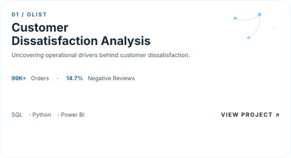
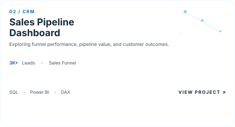

<!-- ======================= HEADER ======================= -->
<div align="center">
  
</div>

<p align="center">
  
</p>

<p align="center">
  <a href="mailto:nguyennguyetgiavy@gmail.com">
    
  </a>&nbsp;

  <a href="https://www.linkedin.com/in/nguyen-nguyet-gia-vy">
    
</p>


<!-- ======================= ABOUT ME ======================= -->
## ABOUT ME
```yaml
analytics_professional:
  philosophy: "Transforming data into clear insights that support better business understanding."
  mission: "Bridging the gap between analytical thinking and real-world business problems."
  focus_areas:
    data_analysis:
      - "Exploring datasets to uncover patterns, trends, and meaningful business insights"
      - "Applying analytical thinking to understand performance and identify improvement opportunities"
    business_intelligence:
      - "Designing interactive dashboards and reports to communicate insights effectively"
      - "Translating business requirements into meaningful metrics and visualizations"
    data_processing:
      - "Cleaning, validating, and preparing data for reliable analysis"
      - "Building a strong foundation in SQL, data modeling, and analytical workflows"
    continuous_learning:
      - "Continuously developing technical skills across analytics, BI, and data-driven problem solving"
      - "Exploring how data can create measurable business impact"
```


<!-- ==================== TECHNICAL SKILLS ================ -->
## TECHNICAL SKILLS
<p align="center">
  
</p>

### Tools & Technologies

<p align="left">
  
  
  
  
  
  
</p>

### Data Analytics

<p align="left">
  
  
  
  
</p>

### Business & Reporting

<p align="left">
  
  
  
  
</p>


<!-- ======================== PROJECTS ===================== -->
## FEATURED PROJECTS

<p align="center">

  <a href="https://github.com/giavy-ng/olist-customer-dissatisfaction-analysis">
    <picture>
      <source
        media="(prefers-color-scheme: dark)"
        srcset="./assets/project-olist-dark.svg">
      <source
        media="(prefers-color-scheme: light)"
        srcset="./assets/project-olist-light.svg">
      
    </picture>
  </a>

  <a href="https://github.com/giavy-ng/crm-sales-pipeline-dashboard">
    <picture>
      <source
        media="(prefers-color-scheme: dark)"
        srcset="./assets/project-crm-dark.svg">
      <source
        media="(prefers-color-scheme: light)"
        srcset="./assets/project-crm-light.svg">
      
    </picture>
  </a>
</p>


<!-- ======================== FOOTERS ===================== -->
<p align="center">
  
</p>
